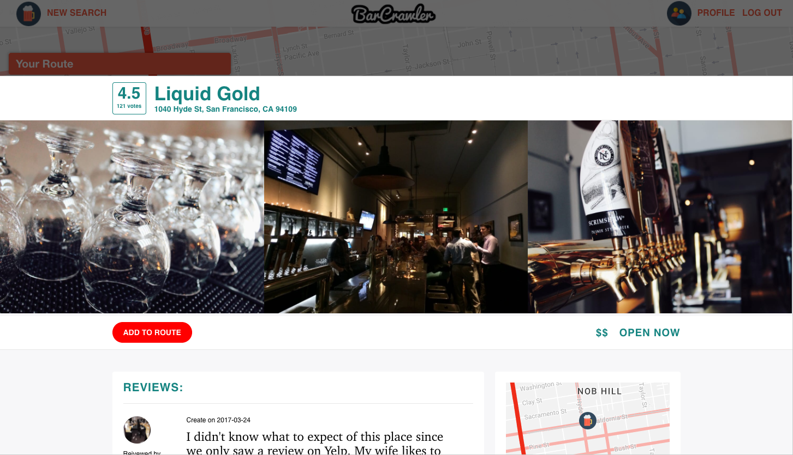
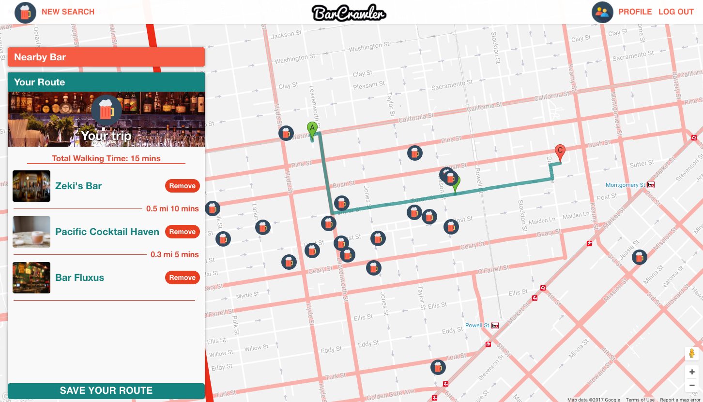
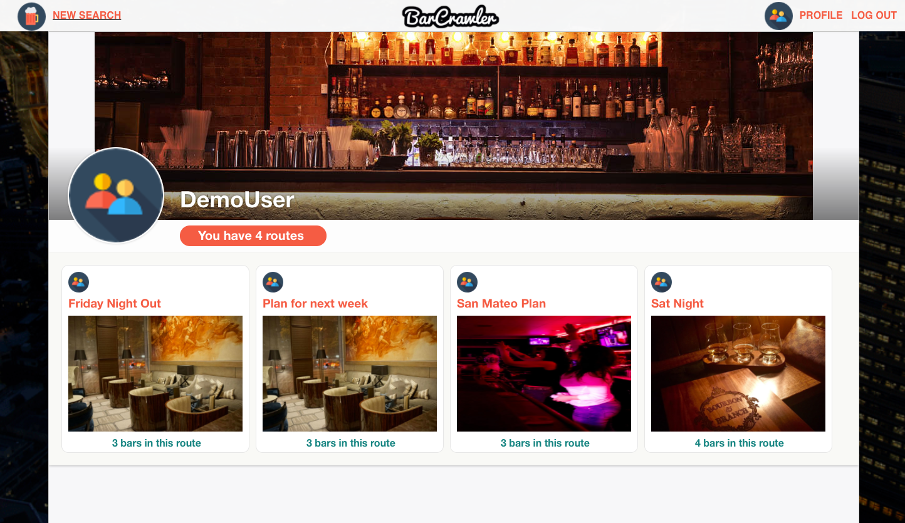
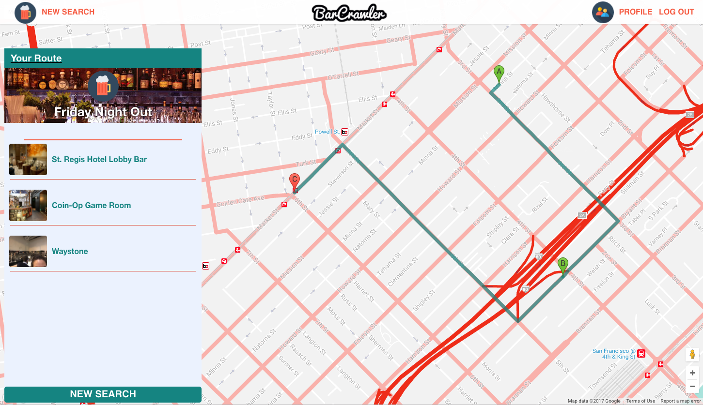

# Bar Crawler

[BarCrawler Live Link](http://barcrawler.aivytran.com/?utm_source=barcrawler&utm_medium=github)

BarCrawler is a full-stack web application. It utilizes Ruby on Rails with a PostgreSQL database on the backend , and React with a Redux architectural framework on the frontend.

## Features & Implementation

### Bars View
Bars View is rendered from two different components: `BarMap` and `SideCol`. All the available bars are fetched from Yelp API on the backend and rendered on the frontend through Redux circle.

`SideCol` renders `BarIndex` and `Route` components.

`BarMap` utilizes Google Map API to render a map and place bar's matching marker on map using its latitude and longitude. The map is interactive; users can drag the map to a new location or zoom in/out to render new bars. When the map's location changed, its l

For better UX/UI, users can see bouncing bar's marker on map that reacts to mouse hovering on side column. `BarMap` interacts with `SideCol` through global `state`. When user hover over a bar on `SideCol`, `changeHoverBar` function is called to dispatch an `action`. The Redux's `store` listens to that `action` and triggers its `reducer` to update the global `state`. When the `state` is update, `BarMap` component triggers its `componentDidUpdate` function, which calls `bounceMarker` function that uses Google Map API's `setAnimation` to make the bar's marker bounce. The same architecture is used to stop marker bouncing once users hover off.

### Route
When viewing bar detail, user can choose to add bar to their route. The map will show a walking route. This features user google map direction api to generate the fastest walking route.

On side column, user can see duration and distance between bars in their route. They then can choose to save the route.

### View Saved Route
On their profile page, user can view all routes that they saved.

They can also click on saved route and see the list of bars and the walking route on map.

