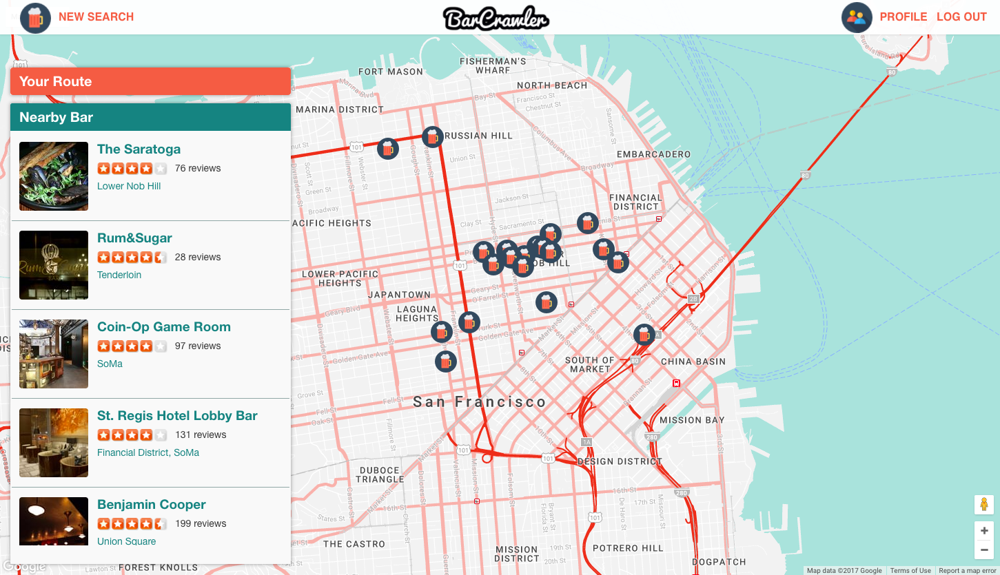

# Bar Crawler

[BarCrawler Link](https://barcrawlersf.herokuapp.com/)

BarCrawler is a full-stack web application. It utilizes Ruby on Rails on the backend, a PostgreSQL database, and React.js with a Redux architectural framework on the frontend.

## Features & Implementation

### Search Bar

On the main page, there is a search bar where you can search for bars in any city, neighborhoods. The search input has autocomplete feature so user don't have to type in the whole word. The search engine uses yelp api to generate nearby bars.

### Map and Bar View
All nearby bars show up in a list and map. User can zoom in/out and drag map to different area to look for new bars.

When hovering over an item on the list, user can see the marker on the bar bouncing.

User can click on item on list or marker on map see detail of certain bar. Information, reviews, and rating of the bar is generated from yelp api.

### Route
When viewing bar detail, user can choose to add bar to their route. The map will show a walking route. This features user google map direction api to generate the fastest walking route.

On side column, user can see duration and distance between bars in their route. They then can choose to save the route.

### View Saved Route
On their profile page, user can view all routes that they saved.

They can also click on saved route and see the list of bars and the walking route on map.

